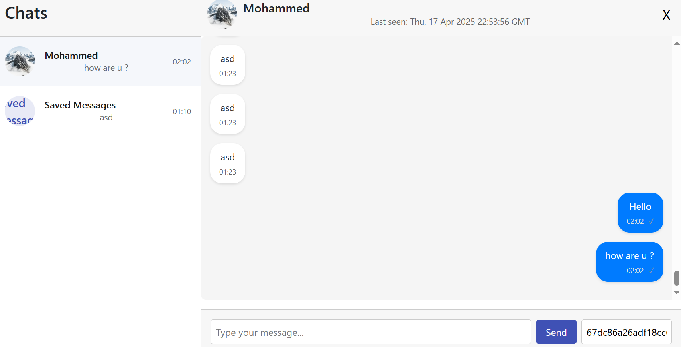
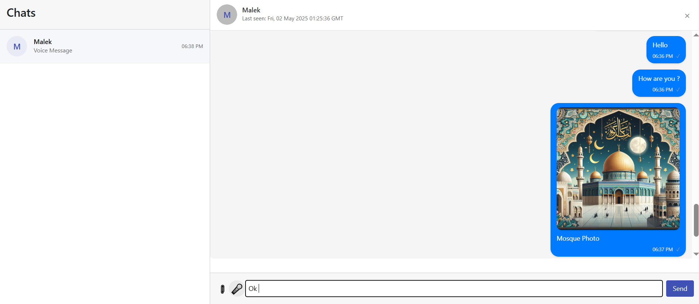
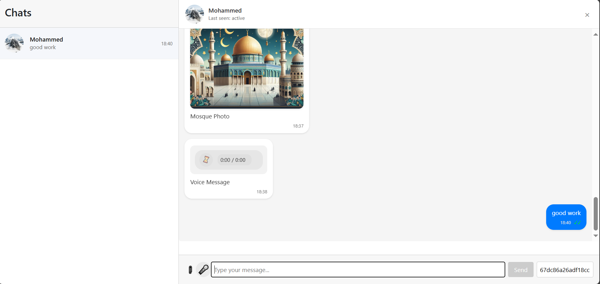
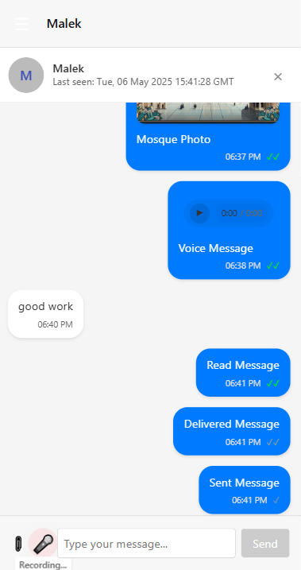

#   ChatSphere - Real-time Chat Application

<div align="center">
  
</div>

## ✨ Key Features
- 🚀 Real-time messaging with Socket.IO
- ✅ Message status indicators (sent, delivered, read)
- 📱 Responsive design for mobile and desktop
- 🗂 Conversation history and chat management
- 📸 Media sharing (images, videos, audio messages, documents)
- 🎤 Voice message recording and playback
- 🔔 Unread message notifications
- 🎨 Modern, intuitive user interface

## 🛠 Tech Stack
- ⚛️ React 18
- 🏗️ JavaScript
- 🎨 CSS Modules
- 🔌 Socket.IO for real-time communication
- 🌐 Axios for API requests
- 🔐 JWT authentication
- ☁️ Cloud storage for media files

## 🚀 Quick Start
Follow these steps to set up the project:

1. Clone the repository:
    ```bash
    git clone https://github.com/mohammedalakhras/ChatSphere.git
    ```

2. Install dependencies:
    ```bash
    cd ChatSphere && npm install
    ```

3. Create a `.env` file with your backend URL:
    ```
    REACT_APP_SERVER_HOST=your_backend_url
    ```

4. Start the development server:
    ```bash
    npm start
    ```

## 📱 App Interface

The application consists of two main sections:
- **Chat List**: Displays all your conversations with last message preview and unread count
- **Chat Window**: Shows the current conversation with message history and status indicators

## 📸 Preview
<div align="center">
  
</div>
<div align="center">
  
</div>
<div align="center">
  
</div>
<div align="center">
  
</div>


## 🌐 Live Demo
[View Demo](https://chat-sphere-five.vercel.app/)

## 🤝 Contributing
We welcome pull requests! Please open an issue first to discuss potential changes.

## 📜 License
MIT © 2025 [Mohammed Al-Akhras](https://t.me/Mohammed_Alakhras)
